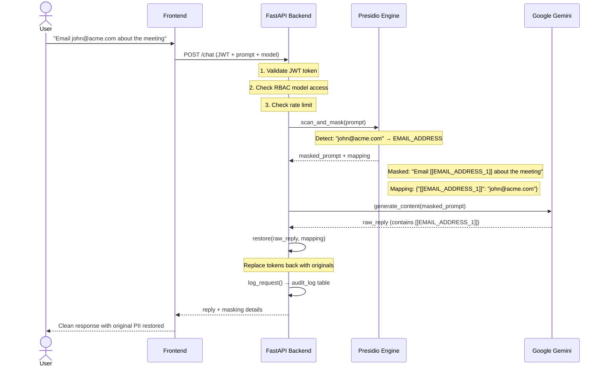
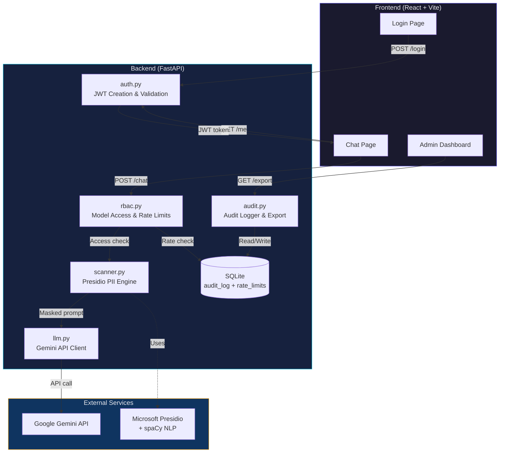
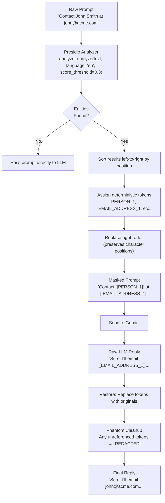
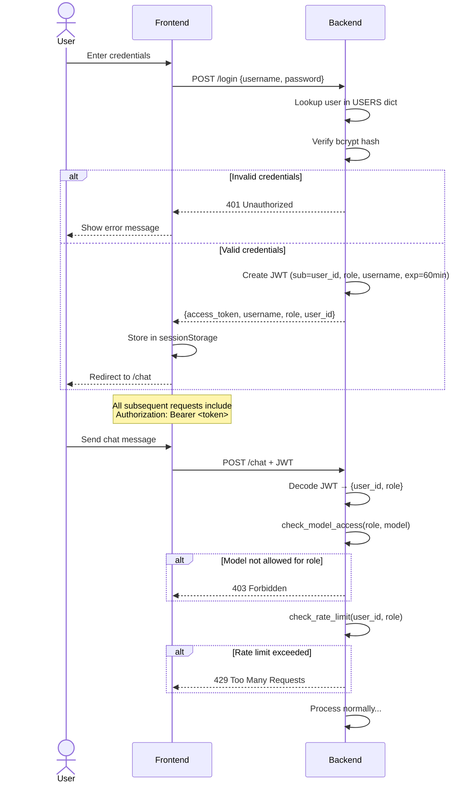
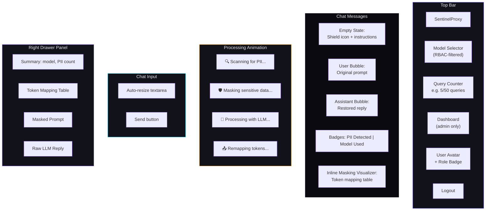
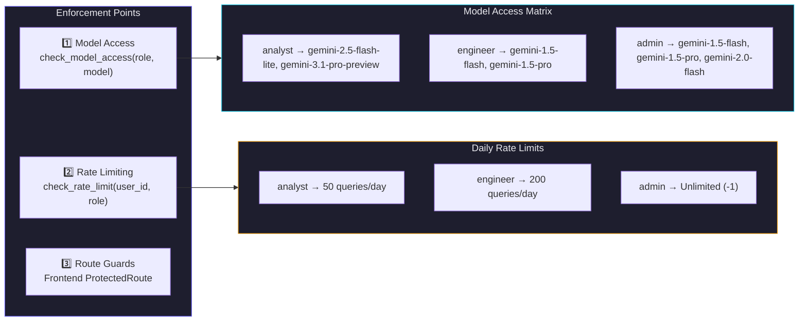

https://www.loom.com/share/18c8046cfea942d093a2f1e53b4c533a
# SentinelProxy

> A secure, privacy-first AI proxy that **intercepts**, **masks**, and **restores** Personally Identifiable Information (PII) in real time — ensuring sensitive data never reaches the LLM.

SentinelProxy sits between users and Google Gemini, acting as a transparent privacy layer. Every prompt passes through Microsoft Presidio's NLP pipeline, where entities like names, emails, and phone numbers are replaced with deterministic tokens (`[[PERSON_1]]`, `[[EMAIL_ADDRESS_1]]`). The LLM processes sanitized text, and SentinelProxy restores the original values before delivering the response back to the user.

---

## Table of Contents

- [How It Works](#-how-it-works)
- [System Architecture](#-system-architecture)
- [PII Masking Pipeline](#-pii-masking-pipeline)
- [Authentication & RBAC Flow](#-authentication--rbac-flow)
- [Features](#-features)
- [Tech Stack](#-tech-stack)
- [Project Structure](#-project-structure)
- [API Reference](#-api-reference)
- [Setup Instructions](#-setup-instructions)
- [Default Test Users](#-default-test-users)
- [Frontend Pages](#-frontend-pages)
- [How RBAC Works](#-how-rbac-works)
- [Audit & Observability](#-audit--observability)

---

## How It Works

The core idea is simple: **the LLM never sees real PII**. Here's what happens when a user sends a message:



**Key insight**: The mapping lives only in memory during the request lifecycle. The LLM processes `[[EMAIL_ADDRESS_1]]` — a meaningless token — and the backend restores the original value after the response arrives.

---

## System Architecture



---

## PII Masking Pipeline

This is the heart of SentinelProxy. The `scanner.py` module uses Microsoft Presidio (backed by spaCy's `en_core_web_lg` model) to perform Named Entity Recognition (NER).

### Supported Entity Types

| Entity | Example | Token Format |
|--------|---------|-------------|
| `PERSON` | John Smith | `[[PERSON_1]]` |
| `EMAIL_ADDRESS` | john@acme.com | `[[EMAIL_ADDRESS_1]]` |
| `PHONE_NUMBER` | +1-555-0123 | `[[PHONE_NUMBER_1]]` |
| `CREDIT_CARD` | 4111-1111-1111-1111 | `[[CREDIT_CARD_1]]` |
| `IBAN_CODE` | DE89370400440532013000 | `[[IBAN_CODE_1]]` |
| `NRP` | Nationality/Religion/Political | `[[NRP_1]]` |
| `MEDICAL_LICENSE` | Medical license numbers | `[[MEDICAL_LICENSE_1]]` |

### Masking Algorithm (Step by Step)



### Why Replace Right-to-Left?

When replacing substrings in a string, replacing from the **end** first ensures that character positions of earlier matches remain valid. If you replace left-to-right, inserting a longer/shorter token shifts all subsequent positions.

```
Original:  "Call John at john@acme.com"
                ^^^^    ^^^^^^^^^^^^^^
                pos 5   pos 13

If we replace pos 5 first → "Call [[PERSON_1]] at john@acme.com"
Now "john@acme.com" is at pos 22, not 13! ❌

Right-to-left: replace pos 13 first → positions stay valid ✅
```

### Phantom Token Cleanup

If the LLM hallucinates or generates new tokens (e.g., `[[PERSON_3]]` when only `PERSON_1` and `PERSON_2` were mapped), the `restore()` function catches them with a regex and replaces them with `[REDACTED]`:

```python
text = re.sub(r'\[\[[A-Z_a-z0-9]+\]\]', '[REDACTED]', text)
```

---

## 🔑 Authentication & RBAC Flow



---

## ✨ Features

### Chat Interface
- **ChatGPT-style UI** — Clean, minimal chat with message bubbles
- **Real-time PII masking visualization** — Animated pipeline showing Scanning → Masking → Processing → Remapping
- **Masking details per message** — See exactly what was masked, the token mapping, and the raw LLM reply
- **Right drawer panel** — Deep-dive into masking details: summary, token mapping table, masked prompt, raw LLM reply
- **Model selector** — Switch between RBAC-permitted Gemini models
- **Query limit counter** — Live display of remaining daily queries
- **Error handling** — Dismissible error banners for rate limits, model access denials, and API failures

### Security
- **JWT authentication** — Stateless tokens with 60-minute expiry
- **Role-Based Access Control** — Three roles (analyst, engineer, admin) with different model access and rate limits
- **PII never reaches the LLM** — Microsoft Presidio + spaCy NER at the proxy layer
- **bcrypt password hashing** — Passlib with auto-deprecation

### Admin Dashboard
- **4 stat cards** — Total queries, PII detected, successful, avg response time
- **4 analytics charts** — Queries per user, role distribution, model usage, PII detection trend
- **Live audit log table** — All fields including masked prompts, with auto-refresh
- **CSV/JSON export** — Download full audit logs

---

## Tech Stack

| Layer | Technology | Purpose |
|-------|-----------|---------|
| **Frontend** | React 19, Vite 8 | UI framework and build tool |
| **Routing** | React Router v7 | Client-side navigation |
| **Charts** | Recharts | Admin dashboard visualizations |
| **Icons** | Lucide React | Consistent icon system |
| **Backend** | Python, FastAPI | REST API server |
| **Server** | Uvicorn | ASGI server |
| **Database** | SQLite | Audit logs and rate limits |
| **Auth** | python-jose (JWT) | Token-based authentication |
| **Passwords** | Passlib (bcrypt) | Secure password hashing |
| **PII Detection** | Microsoft Presidio | NER-based PII analysis |
| **NLP Model** | spaCy (en_core_web_lg) | Named entity recognition |
| **LLM** | Google Generative AI | Gemini model integration |

---

##  Project Structure

```
sentinalproxy/
├── backend/
│   ├── main.py              # FastAPI app: routes for /login, /chat, /me, /export
│   ├── auth.py              # JWT creation & validation (HS256, 60min expiry)
│   ├── rbac.py              # Role→model mapping, role→rate limits, enforcement
│   ├── scanner.py           # Presidio PII scan, mask (tokenize), restore (de-tokenize)
│   ├── llm.py               # Google Gemini API client (genai.Client)
│   ├── audit.py             # Audit log writer + JSON/CSV export
│   ├── database.py          # SQLite init (audit_log + rate_limits tables)
│   ├── models.py            # Pydantic schemas (ChatRequest/Response, LoginRequest/Response, UserProfile)
│   ├── users.py             # Hardcoded users with bcrypt-hashed passwords
│   ├── requirements.txt     # Python dependencies
│   └── .env.example         # Environment variable template
│
└── frontend/
    ├── index.html           # HTML shell (Inter font, meta tags)
    ├── vite.config.js       # Vite configuration
    ├── package.json         # Node dependencies
    └── src/
        ├── main.jsx         # React entry point
        ├── App.jsx          # Router setup + auth guards (ProtectedRoute, adminOnly)
        ├── index.css        # Design tokens, CSS reset, keyframe animations
        │
        ├── api/
        │   └── client.js    # API functions: loginApi, fetchProfile, sendChat, fetchLogs, downloadCSV
        │
        ├── context/
        │   └── AuthContext.jsx  # React context for auth state (sessionStorage persistence)
        │
        ├── hooks/
        │   └── useProfile.js    # Custom hook: fetch user profile (models, limits, usage)
        │
        ├── pages/
        │   ├── LoginPage.jsx    # Login form with branded card + gradient orbs
        │   ├── ChatPage.jsx     # Chat orchestrator (messages, input, drawer, processing viz)
        │   └── AdminPage.jsx    # Dashboard with stats, charts, audit table, CSV export
        │
        ├── components/
        │   ├── chat/
        │   │   ├── ChatInput.jsx            # Auto-resizing textarea with Enter-to-send
        │   │   ├── MessageBubble.jsx         # User/assistant message with PII badges
        │   │   ├── MaskingVisualizer.jsx     # Inline token mapping table + masked prompt
        │   │   ├── MaskingDrawer.jsx         # Right slide-out panel with full masking details
        │   │   └── ProcessingVisualizer.jsx  # Animated steps: Scan → Mask → Process → Remap
        │   ├── layout/
        │   │   ├── TopBar.jsx               # Brand, model selector, limits, profile, logout
        │   │   └── ModelSelector.jsx        # Dropdown for switching Gemini models
        │   └── admin/
        │       ├── StatsCards.jsx           # 4 metric cards (total, PII, success, avg ms)
        │       ├── Charts.jsx              # 4 Recharts panels (bar, pie, horizontal bar, area)
        │       └── AuditTable.jsx          # Scrollable audit log table
        │
        └── styles/
            ├── login.css    # Login page styles (gradient orbs, glassmorphism)
            ├── chat.css     # Chat styles (topbar, messages, input, drawer, processing)
            └── admin.css    # Admin dashboard styles (stats grid, chart cards, audit table)
```

---

## 📡 API Reference

### `POST /login`

Authenticate and receive a JWT token.

```json
// Request
{ "username": "carol", "password": "carol123" }

// Response 200
{
  "access_token": "eyJhbGciOiJIUzI1NiIs...",
  "token_type": "bearer",
  "username": "carol",
  "role": "admin",
  "user_id": "u3"
}
```

### `GET /me`

Fetch the authenticated user's profile, available models, and usage.

```json
// Response 200 (requires Bearer token)
{
  "user_id": "u3",
  "username": "carol",
  "role": "admin",
  "allowed_models": ["gemini-1.5-flash", "gemini-1.5-pro", "gemini-2.0-flash"],
  "query_limit": -1,
  "queries_used_today": 5
}
```

### `POST /chat`

Send a prompt through the PII masking pipeline. Returns the restored reply along with full masking details.

```json
// Request (requires Bearer token)
{ "prompt": "Email john@acme.com about the project", "model": "gemini-1.5-flash" }

// Response 200
{
  "reply": "Sure, I'll draft an email to john@acme.com about the project.",
  "model_used": "gemini-1.5-flash",
  "masked_prompt": "Email [[EMAIL_ADDRESS_1]] about the project",
  "pii_detected": true,
  "mapping": { "[[EMAIL_ADDRESS_1]]": "john@acme.com" },
  "raw_llm_reply": "Sure, I'll draft an email to [[EMAIL_ADDRESS_1]] about the project."
}
```

### `GET /export?fmt=json|csv`

Export audit logs (admin only).

```
GET /export?fmt=csv → Downloads sentinel_audit.csv
GET /export?fmt=json → Returns JSON array of all audit entries
```

### Error Responses

| Code | Scenario |
|------|----------|
| `401` | Invalid credentials or expired JWT |
| `403` | Role cannot access requested model, or non-admin accessing export |
| `429` | Daily rate limit exceeded for role |
| `500` | LLM API error or internal failure |

---

## ⚡ Setup Instructions

### Prerequisites

- Python 3.10+
- Node.js 18+
- A [Google Gemini API Key](https://aistudio.google.com/apikey)

### 1. Backend

```bash
cd backend

# Create and activate virtual environment
python -m venv venv
# Windows:
venv\Scripts\activate
# macOS/Linux:
source venv/bin/activate

# Install Python dependencies
pip install -r requirements.txt

# Download the spaCy NLP model (required by Presidio for NER)
python -m spacy download en_core_web_lg
```

Create a `.env` file in the `backend/` directory:

```env
GEMINI_API_KEY=your_google_gemini_api_key
JWT_SECRET_KEY=your_secure_random_secret_key
```

Start the server:

```bash
uvicorn main:app --reload
# → http://localhost:8000
# → Swagger docs: http://localhost:8000/docs
```

### 2. Frontend

```bash
cd frontend
npm install
npm run dev
# → http://localhost:5173
```

---

## 👤 Default Test Users

| Username | Password | Role | Models Available | Daily Query Limit |
|----------|----------|------|-----------------|-------------------|
| `alice` | `alice123` | **analyst** | gemini-2.5-flash-lite, gemini-3.1-pro-preview | 50 |
| `bob` | `bob123` | **engineer** | gemini-1.5-flash, gemini-1.5-pro | 200 |
| `carol` | `carol123` | **admin** | gemini-1.5-flash, gemini-1.5-pro, gemini-2.0-flash | Unlimited |

> ⚠️ In production, users should be stored in a database with properly salted/hashed passwords. The hardcoded dictionary in `users.py` is for demonstration only.

---

## 🖥️ Frontend Pages

### 1. Login (`/login`)

Branded login card with animated gradient background orbs. Validates credentials against the backend and stores the JWT + user info in `sessionStorage`. Auto-redirects authenticated users to `/chat`.

### 2. Chat (`/chat`)

The main interface — a ChatGPT-style chat with:



### 3. Admin Dashboard (`/admin`)

Accessible only to users with the `admin` role. Features:
- **4 stat cards** — Total queries, PII detections, success rate, avg response time
- **4 charts** — Queries per user (bar), role distribution (pie), model usage (horizontal bar), PII trend + response time (area)
- **Audit log table** — All fields including masked prompts, auto-refreshes every 15s
- **CSV export** — Download the full audit log

---

## How RBAC Works

Role-Based Access Control is enforced at two levels:



**Rate limiting** uses a SQLite table (`rate_limits`) that tracks per-user daily counts. The counter resets automatically each day by checking the stored date against `date.today()`.

**Frontend enforcement**: The `ModelSelector` component only shows models the user's role permits (fetched from `GET /me`). The admin dashboard route (`/admin`) is guarded by `adminOnly` on the `ProtectedRoute` wrapper.

---

## Audit & Observability

Every `/chat` request is logged to the `audit_log` table with:

| Column | Type | Description |
|--------|------|-------------|
| `id` | INTEGER | Auto-increment primary key |
| `timestamp` | TEXT | ISO 8601 UTC timestamp |
| `user_id` | TEXT | Who made the request (e.g., u1, u2, u3) |
| `role` | TEXT | User's role at time of request |
| `model` | TEXT | Which Gemini model was used |
| `masked_prompt` | TEXT | The sanitized prompt (PII replaced with tokens) |
| `pii_detected` | INTEGER | 1 if PII was found, 0 otherwise |
| `status` | TEXT | "success" or "error: <message>" |
| `response_time_ms` | INTEGER | End-to-end latency in milliseconds |

The admin dashboard surfaces this data through:
- **Real-time charts** that auto-refresh every 15 seconds
- **Stat cards** computing aggregates (total, PII count, success rate, avg latency)
- **Downloadable CSV** for offline analysis

---

## 📄 License

This project is for educational and demonstration purposes.
